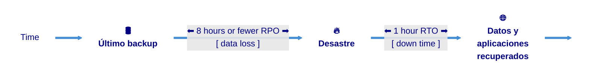
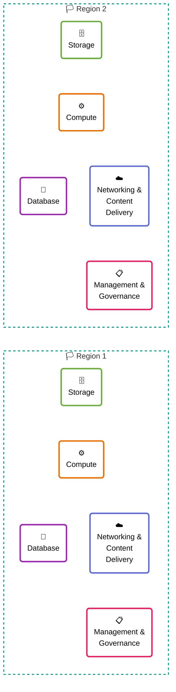

# Planeamiento para desastres

> Esta clase abarca el módulo 16 del curso de AWS Cloud Architecting

## Objetivos

- Identificar estrategias de planificación de actividades ante desastres, incluyendo los recovery point objective (RPO) y los recovery time objective (RTO) sobre la base de los requerimientos de negocio.
- Identificar las categorías de servicios de planeamiento para desastres de AWS.
- Describir los patrones comunes para la recuperación ante desastres y cómo implementarlos.
- Aplicar los principios del AWS Well-Architected Framework al diseño de un plan de recuperación ante desastres.

### Objetivos de un arquitecto de nube

- Diseñar arquitecturas que mitigan el riesgo ante desastres y permiten una recuperación oportuna cuando suceden, para contribuir a minimizar el impacto de un desastre en el negocio.
- Considerar las necesidades de negocio para aplicar patrones de recuperación ante desastres que balanceen el costo, la pérdida de datos y el tiempo de recuperación.

### Estrategias de recuperación

### Escala de eventos

- Eventos de menor escala
  - Caída de servidor
- Eventos a gran escala
  - Múltiples recursos no disponibles en una Availability Zone
- Evento global
  - Falla generalizada que afecta a múltiples usuarios y sistemas

### Estrategias de continuidad

- Fault tolerance
  - Minimizar la frecuencia de situaciones que dejan los datos no disponibles
- Backup
  - Asegurar la existencia de un plan de backup para gestionar los datos ante desastres.
- Disaster recovery
  - Recuperar los datos y reestablecer las aplicaciones después de un desastre. 
- Dependencia del tiempo
  - ¿Con qué velocidad debemos recuperar los servicios para minimizar el impacto?
- Pérdida de datos
  - ¿Qué cantidad de datos toleramos perder?
  - ¿Qué tipos de datos podemos perder?
- Ubicación geográfica
  - ¿Tiene impacto en varias regiones?
  - ¿Las distintas regiones requieren medidas de recuperación distintas?
- Costo
  - ¿El nivel de costos es acorde al impacto en el negocio y a los riesgos?

### Determinación del RPO

Es la pérdida de datos máxima que resulta aceptable, medida en tiempo.

- Determinar que una pérdida máxima de 800 registros es aceptable para tu aplicación
- Usar los patrones existentes para determinar que no se crean más de 100 registros por hora
- Calcular el RPO aceptable de 8 horas.

> Con esta información, podemos ver que, si a las 10 pm se produce un desastre, el sistema debería poder recuperar toda la información que estaba en el sistema antes de las 2pm

### Determinación del RTO

RTO es el tiempo máximo de indisponibilidad de un proceso después de que se produce un desastre.

### Determinación del RTO

- Determinar que un servicio de tickets para un show musical se debe restaurar dentro de dos horas
- El negocio calcula que después de 2 horas de caída, comenzará a perder ganancias por ventas perdidas
- Calcular un RTO aceptable de 2 horas

> Sobre la base de esta información, si un desastre ocurre a las 9 p.m., el Sistema se debería poder recuperar antes de las 11 pm

### Preparación para el BCP

Un plan de continuidad de negocios (BCP) es un sistema para la prevención y la recuperación respecto de amenazas potenciales para una compañía.

Un BCP está conformado por:
- Business Impact Analysis
- Evaluación de riesgos
- Disaster Recovery Plan
- RPO y RTO evaluados y definidos

## AWS Disaster Recovery Planning

### DRP en más de una región

### Almacenamiento y backups

- Una solución con tal de prevenir estos desastres es replicar los buckets (o la forma de almacenamiento que tengamos) en diferentes regiones

### Snapshots de volúmenes de EBS

> A partir de acá el PPT es completamente autodescriptivo. Adjunto el pdf embebido (lean a partir de la slide 20):

<embed src="https://github.com/FranCalveyra/aws/blob/main/src/presentations/Nube%20con%20AWS%20-%20Clase%2014.pdf" type="application/pdf" width="100%" height="600px" />
