# Planeamiento para desastres

> Esta clase abarca el módulo 16 del curso de AWS Cloud Architecting

## Objetivos

- Identificar estrategias de planificación de actividades ante desastres, incluyendo los recovery point objective (RPO) y los recovery time objective (RTO) sobre la base de los requerimientos de negocio.
- Identificar las categorías de servicios de planeamiento para desastres de AWS.
- Describir los patrones comunes para la recuperación ante desastres y cómo implementarlos.
- Aplicar los principios del AWS Well-Architected Framework al diseño de un plan de recuperación ante desastres.

### Objetivos de un arquitecto de nube

- Diseñar arquitecturas que mitigan el riesgo ante desastres y permiten una recuperación oportuna cuando suceden, para contribuir a minimizar el impacto de un desastre en el negocio.
- Considerar las necesidades de negocio para aplicar patrones de recuperación ante desastres que balanceen el costo, la pérdida de datos y el tiempo de recuperación.

### Estrategias de recuperación

### Escala de eventos

- Eventos de menor escala
  - Caída de servidor
- Eventos a gran escala
  - Múltiples recursos no disponibles en una Availability Zone
- Evento global
  - Falla generalizada que afecta a múltiples usuarios y sistemas

### Estrategias de continuidad

- Fault tolerance
  - Minimizar la frecuencia de situaciones que dejan los datos no disponibles
- Backup
  - Asegurar la existencia de un plan de backup para gestionar los datos ante desastres.
- Disaster recovery
  - Recuperar los datos y reestablecer las aplicaciones después de un desastre. 
- Dependencia del tiempo
  - ¿Con qué velocidad debemos recuperar los servicios para minimizar el impacto?
- Pérdida de datos
  - ¿Qué cantidad de datos toleramos perder?
  - ¿Qué tipos de datos podemos perder?
- Ubicación geográfica
  - ¿Tiene impacto en varias regiones?
  - ¿Las distintas regiones requieren medidas de recuperación distintas?
- Costo
  - ¿El nivel de costos es acorde al impacto en el negocio y a los riesgos?

### Determinación del RPO

Es la pérdida de datos máxima que resulta aceptable, medida en tiempo.

- Determinar que una pérdida máxima de 800 registros es aceptable para tu aplicación
- Usar los patrones existentes para determinar que no se crean más de 100 registros por hora
- Calcular el RPO aceptable de 8 horas.

> Con esta información, podemos ver que, si a las 10 pm se produce un desastre, el sistema debería poder recuperar toda la información que estaba en el sistema antes de las 2pm

### Determinación del RTO

RTO es el tiempo máximo de indisponibilidad de un proceso después de que se produce un desastre.

```mermaid
flowchart LR
    %% --- Nodes ---
    Time[Time]
    
    %% Using Emojis for the icons
    Backup["🛢️<br>Último backup"]
    Disaster["🔥<br>Desastre"]
    Recovery["🌐<br>Datos y<br>aplicaciones<br>recuperados"]
    
    %% Hidden node to create the final arrow tip
    EndNode(( ))

    %% --- Connections (Timeline) ---
    %% We use thick links (==) for the timeline bar
    
    Time ==> Backup
    
    %% Connection: Backup to Disaster (RPO)
    Backup == "⬅ 8 hours or fewer RPO ➡<br>[ data loss ]" ==> Disaster
    
    %% Connection: Disaster to Recovery (RTO)
    Disaster == "⬅ 1 hour RTO ➡<br>[ down time ]" ==> Recovery
    
    %% Final arrow
    Recovery --> EndNode

    %% --- Styling ---
    
    %% 1. Style the main Event Nodes (White bg, Dark Blue text, no border)
    classDef eventNode fill:#fff,stroke:none,font-weight:bold,color:#000080
    class Backup,Disaster,Recovery eventNode

    %% 2. Style the "Time" label
    style Time fill:#fff,stroke:none,font-size:16px,color:#000080

    %% 3. Hide the end node
    style EndNode fill:none,stroke:none

    %% 4. Style the Timeline Links (Thick Blue Line, Dark Blue Text)
    linkStyle 0,1,2,3 stroke:#438dd5,stroke-width:4px,color:#000080
```

### Determinación del RTO

- Determinar que un servicio de tickets para un show musical se debe restaurar dentro de dos horas
- El negocio calcula que después de 2 horas de caída, comenzará a perder ganancias por ventas perdidas
- Calcular un RTO aceptable de 2 horas

> Sobre la base de esta información, si un desastre ocurre a las 9 p.m., el Sistema se debería poder recuperar antes de las 11 pm

### Preparación para el BCP

Un plan de continuidad de negocios (BCP) es un sistema para la prevención y la recuperación respecto de amenazas potenciales para una compañía.

Un BCP está conformado por:
- Business Impact Analysis
- Evaluación de riesgos
- Disaster Recovery Plan
- RPO y RTO evaluados y definidos

## AWS Disaster Recovery Planning

### DRP en más de una región

```mermaid
flowchart LR
    %% --- Region 1 ---
    subgraph R1 ["🏳️ Region 1"]
        direction TB
        %% Row 1
        S1("🗄️<br>Storage"):::green
        C1("⚙️<br>Compute"):::orange
        D1("💽<br>Database"):::purple
        
        %% Row 2
        N1("☁️<br>Networking &<br>Content<br>Delivery"):::blue
        M1("📋<br>Management &<br>Governance"):::pink

        %% Layout: Force Row 1 above Row 2
        S1 ~~~ C1 ~~~ D1
        C1 ~~~ N1
        N1 ~~~ M1
    end

    %% --- Region 2 (Identical Copy) ---
    subgraph R2 ["🏳️ Region 2"]
        direction TB
        %% Row 1
        S2("🗄️<br>Storage"):::green
        C2("⚙️<br>Compute"):::orange
        D2("💽<br>Database"):::purple
        
        %% Row 2
        N2("☁️<br>Networking &<br>Content<br>Delivery"):::blue
        M2("📋<br>Management &<br>Governance"):::pink

        %% Layout
        S2 ~~~ C2 ~~~ D2
        C2 ~~~ N2
        N2 ~~~ M2
    end

    %% --- Styling ---
    %% 1. Node Styles (White bg, Colored Border)
    classDef green fill:#fff,stroke:#6cae3e,stroke-width:3px,color:#000;
    classDef orange fill:#fff,stroke:#ed7100,stroke-width:3px,color:#000;
    classDef purple fill:#fff,stroke:#9c27b0,stroke-width:3px,color:#000;
    classDef blue fill:#fff,stroke:#5e6ad2,stroke-width:3px,color:#000;
    classDef pink fill:#fff,stroke:#e91e63,stroke-width:3px,color:#000;

    %% 2. Region Box Style (Teal dashed border)
    style R1 fill:#fff,stroke:#009688,stroke-width:2px,stroke-dasharray: 5 5,color:#333
    style R2 fill:#fff,stroke:#009688,stroke-width:2px,stroke-dasharray: 5 5,color:#333
```

### Almacenamiento y backups

- Una solución con tal de prevenir estos desastres es replicar los buckets (o la forma de almacenamiento que tengamos) en diferentes regiones

### Snapshots de volúmenes de EBS

> A partir de acá el PPT es completamente autodescriptivo. Adjunto el pdf embebido (lean a partir de la slide 20):

<embed src="https://github.com/FranCalveyra/aws/blob/main/src/presentations/Nube%20con%20AWS%20-%20Clase%2014.pdf" type="application/pdf" width="100%" height="600px" />
