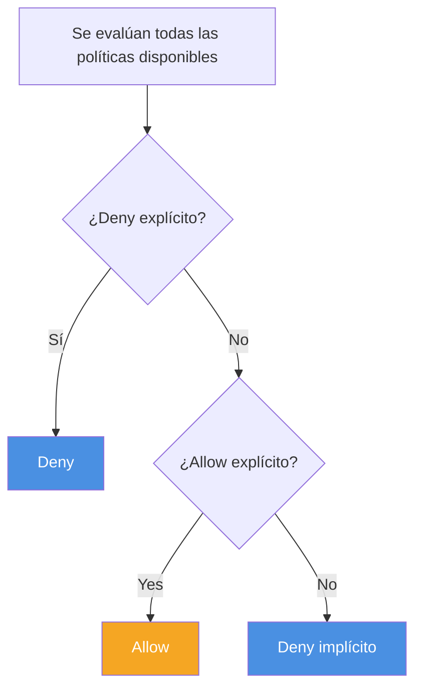

# Seguridad de acceso

## Modelos de responsabilidad compartida

## Principios de diseño

Gestión de identidades

## AWS Identity and Access Manager (IAM)

- Control de accesos a recursos de AWS para individuos o grupos
- Integración con otros servicios
- Federación de identidades
- Autenticación multifactor
- Permisos granulares

### Autenticar | Autorizar
No pienso mencionar la diferencia a esta altura.

### Definiciones

| Concepto      | Definición                                                                  | Ejemplos                                                     |
| ------------- | --------------------------------------------------------------------------- | ------------------------------------------------------------ |
| **Recurso**   | Objeto almacenado en IAM                                                    | Usuario, grupo, rol o política                               |
| **Entidad**   | Recurso de IAM que AWS usa para autenticación                               | Roles y usuarios                                             |
| **Identidad** | Recurso de IAM que puede recibir una autorización en una política de acceso | Usuarios, roles y grupos                                     |
| **Principal** | Persona o aplicación que puede ingresar (sign in) y generar requests en AWS | Usuarios y aplicaciones que interactúan con servicios de AWS |

### Acceso a recursos en AWS

| Tipo de Recurso | Definición                                                                       |
| --------------- | -------------------------------------------------------------------------------- |
| **Usuario**     | Una persona o aplicación que puede autenticarse con una cuenta de AWS            |
| **Grupo**       | Un grupo de usuarios IAM que tienen permisos idénticos                           |
| **Rol**         | Identidad que se utiliza para otorgar un conjunto **temporario** de permisos     |
| **Política**    | Documento que define los recursos accesibles y los niveles de acceso de cada uno |

### Autenticación
#### Credenciales
Tenés 2 formas de autenticarte dentro del ecosistema de AWS:
- Credenciales de usuario
  - Autenticación en la consola
  - Mail y contraseña
- AWS Access Key
  - AWS CLI
  - SDK
  - API Calls
  - Access Key ID + Secret Access Key

### Buenas prácticas de control de accesos

- Aplicar el principio de mínimo privilegio
- Habilitar la autenticación multifactor (MFA)
- Implementar el uso de credenciales temporales siempre que se pueda
- Rotar las claves de acceso para el uso de credenciales de largo plazo
- Usar contraseñas fuertes y complejas
- Proteger las credenciales locales
- Usar AWS Organizations

### Principio del mínimo privilegio

### Buenas prácticas de control de accesos

#### Proteger el usuario administrador

#### Usuarios y grupos

### Roles IAM en AWS

#### Definiciones

| ¿Qué es?                                                        | ¿Cuándo se usa?                                                                                        |
| --------------------------------------------------------------- | ------------------------------------------------------------------------------------------------------ |
| Un medio para obtener **credenciales transitorias**             | Cuando queremos delegar un acceso sin asignar permisos permanentes a un principal                      |
| No está asociado de manera unívoca con una persona              | **Ejemplos:**                                                                                          |
| Puede ser asumido por una persona, una aplicación o un servicio | - Accesos entre distintas cuentas de AWS - Aplicaciones móviles - Aplicaciones que corren en EC2 |

#### Políticas y permisos

**Definición de permisos en políticas IAM**:
- Se suelen definir en formato de JSON
- La política define los recursos y operaciones permitidos y denegados
- Siguen el principio de mínimo privilegio

**Proteger el usuario administrador**

**Evaluación de políticas IAM**

Políticas

Ejemplos

### Identity-based Resource-based

(Asociada con un usuario, grupo o rol) (Attached to an AWS resource)

Juan Bucket 1

Recurso Get Put List User Get Put List

Bucket 2 Allow Allow Allow Juan Allow Deny Allow

Bucket 3 N/A N/A Allow

Bucket 2

User Get Put List

### Juan Allow N/A Allow

¿Qué puede hacer Juan en el bucket 1? ¿Y en el bucket 2?

Políticas

Ejemplos

### Identity-based Resource-based

(Asociada con un usuario, grupo o rol) (Attached to an AWS resource)

Juan Bucket 1

Recurso Get Put List User Get Put List

Bucket 2 Allow Allow Allow Juan Allow Deny Allow

Bucket 3 N/A N/A Allow

Bucket 2

User Get Put List

### Juan Allow N/A Allow

¿Qué puede hacer Juan en el bucket 1? ¿Y en el bucket 2?

Estructura de una política

Elemento Información

### Version Versión del lenguaje que queremos usar

Statement Define qué se permite o deniega en función de ciertas condiciones

### Effect Allow o deny

Principal Política basada en recursos. La cuenta, usuario, rol o usuario federado al que se

otorga o deniega el permiso.

Política basada en identidades. Este dato es implícito, y corresponde al usuario o el

rol al que se asocial la política.

Action La acción sobre la cual se otorga o deniega el permiso.

### Ejemplo: "Action": "s3:GetObject"

Resource Recurso o recursos a los que se aplica la acción.

Por ejemplo: "Resource": "arn:aws:sqs:us-west-2:123456789012:queue1"

(ARN = AWS resource name)

Condition Condiciones que deben cumplirse para que se aplique la regla

Ejemplos

Política basada en recursos

{

"Version":"2012-10-17",

"Statement":[{

"Effect":"Allow",

"Action":["dynamoDB:*","s3:*"

],

"Resource":[

"arn:aws:dynamodb:region:account-number-

without-hyphens:table/course-notes",

"arn:aws:s3:::course-notes-web",

"arn:aws:s3:::course-notes-mp3/*"]

},

{

"Effect":"Deny",

"Action":["dynamodb:*","s3:*"

],

"NotResource":[

"arn:aws:dynamodb:region:account-number-without-

hyphens:table/course-notes",

"arn:aws:s3:::course-notes-web",

"arn:aws:s3:::course-notes-mp3/*"]

}

]

}

Ejemplos

Política basada en identidades

{

"Version":"2012-10-17",

"Statement":[{

"Effect":"Allow",

"Action":[

"iam:*LoginProfile",

"iam:*AccessKey*",

"iam:*SSHPublicKey*"

],

"Resource":[

"arn:aws:iam::account-id-without-hyphens:user/${aws:username}"

}

}

IAM API Reference

Actividad

Análisis de políticas IAM

Caso 1

Revisemos esta política

{

"Version":"2012-10-17", 1. ¿Sobre qué servicio de AWS asigna

"Statement":{ accesos?

"Effect":"Allow",

2. ¿Permite la política crear un usuario,

"Action":[

grupo, política o rol?

"iam:Get*",

"iam:List*"

## Identificar tres acciones específicas que

],

permite la acción iam:Get*

"Resource":"*"

}

}

IAM API Reference

Caso 2

¿Qué permite hacer esta política?

{

"Version":"2012-10-17",

"Statement":[{

"Effect":"Allow", 1. ¿Esta política permite eliminar cualquier

"Action":"ec2:TerminateInstances", instancia de EC2 sin restricciones?

"Resource":"*"

2. ¿Permite ejecutar la acción desde

},

cualquier lugar?

{

"Effect":"Deny",

3. ¿Podría eliminar la instancia si me conecto

"Action":"ec2:TerminateInstances",

desde la IP 192.0.2.243?

"Condition":{

"NotIpAddress":{

"aws:SourceIp":[

"192.0.2.0/24",

"203.0.113.0/24"

]

}

},

"Resource":"*"

... IAM API Reference

Caso 3

¿Qué permite hacer esta política?

{

"Version":"2012-10-17",

"Statement":[{

"Condition":{

1. ¿Qué acciones permite esta política?

"StringNotEquals":{

"ec2:InstanceType":[ 2. ¿Qué pasaría si agregáramos este

"t2.micro",

statement?

"t2.small"]

{

}

"Effect": "Allow",

},

"Action": "ec2:*"

"Resource":"arn:aws:ec2:*:*:instance

}

/*",

"Action":[ 3. En ese caso, ¿el usuario podría

"ec2:RunInstances",

eliminar una instancia m3.xlarge de la

"ec2:StartInstances"

cuenta?

],

"Effect":"Deny"

}

]

}

IAM API Reference

Actividades

AWS Academy

Material Laboratorio

Guía de estudio del Exploring IAM Lab

módulo 3

WAF - Pilar de seguridad Vencimiento: 22/8

Muchas gracias.

www.austral.edu.ar

